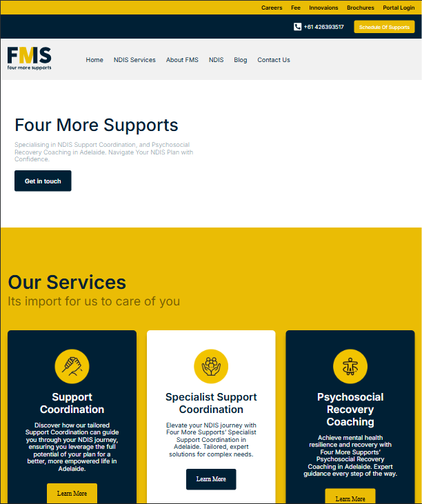

# Four More Supports 🩺  
An intuitive and user-friendly application for booking doctors, ensuring seamless healthcare access at your fingertips.  

## 🚀 Features  
- 📅 **Book Appointments**: Effortlessly schedule visits with your preferred doctor.  
- 🔍 **Search Doctors**: Find specialists based on expertise, location, or availability.  
- 📌 **Appointment Management**: View, reschedule, or cancel appointments with ease.  
- 🔒 **Secure Access**: Role-based access control (RBAC) for patients and doctors.  
- 🛠️ **User-friendly Interface**: Clean and modern design for a smooth experience.  

## 🛠️ Tech Stack  
- **Frontend**: Next JS, scss  
- **Backend**: Next JS  
- **Database**: MongoDB  
- **Authentication**: OAuth2.0, JWT  
- **Payment Gateway**: Integrated for easy consultation fee payments.  

## 📦 Installation  
1. Clone the repository:  
   ```bash
   git clone https://github.com/Yahya305/FourMoreSupports.git
   cd FourMoreSupports

  
2. Install dependencies:  
   ```bash
   npm install
  
3. Start the development server:  
   ```bash
   npm run dev

## 📸 Screenshots
Coming soon!### Dashboard
### Dashboard
<div align="center">
    <br/><br/><br/>
    <p align="justify"> 
      A tool which parses information from a resume using natural language processing and finds the keywords, cluster them onto sectors based on their keywords. 
      And lastly show recommendations, predictions, analytics to the applicant / recruiter based on keyword matching.
    </p>
</div>

## 📬 Contact  
For queries or feedback, reach out to me at [saimyahya47@gmail.com](mailto:saimyahya47@gmail.com).  

